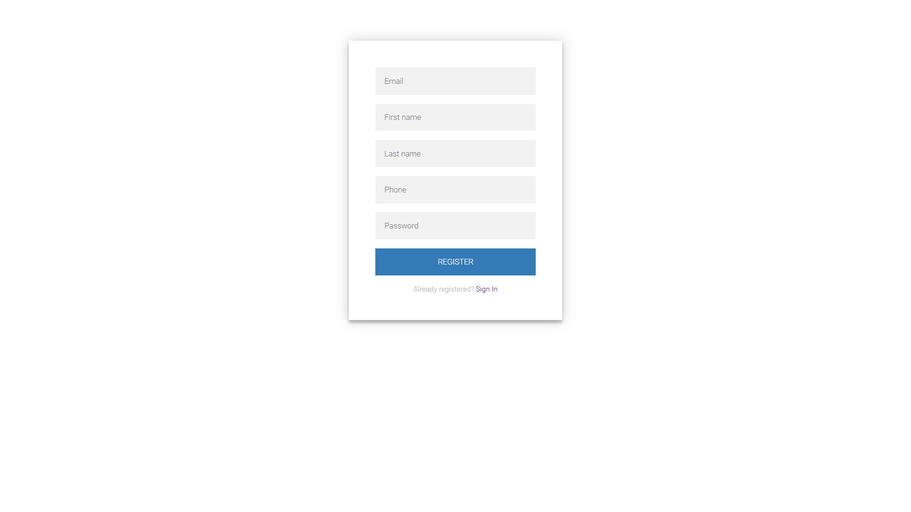
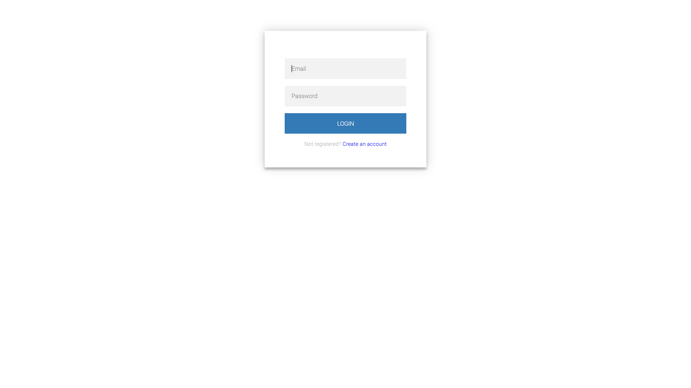
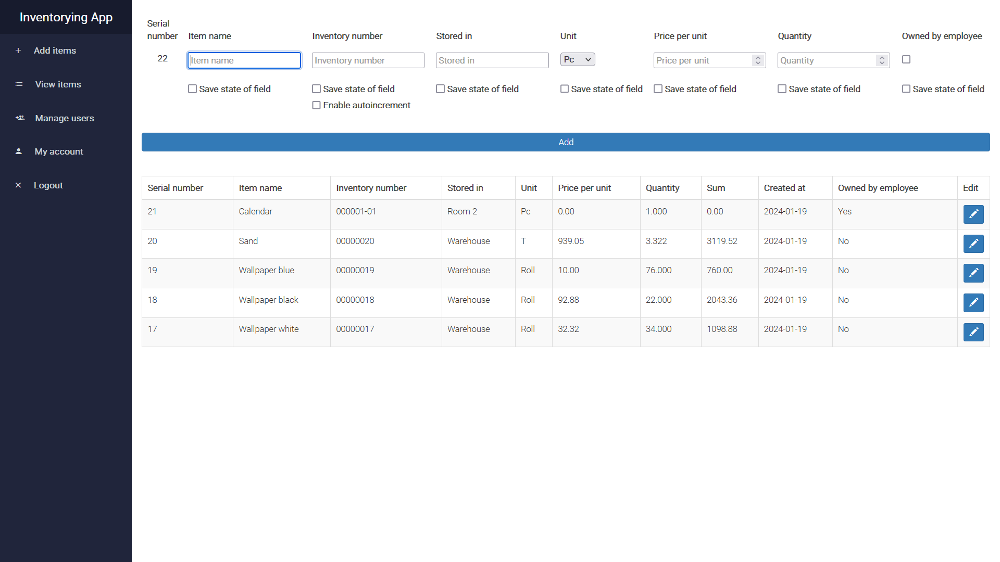
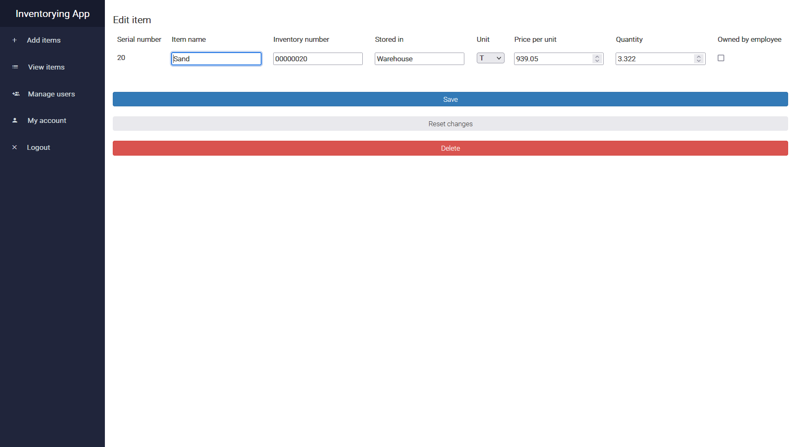
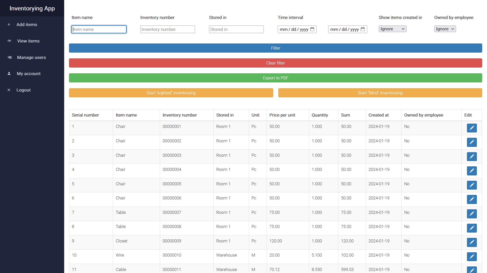
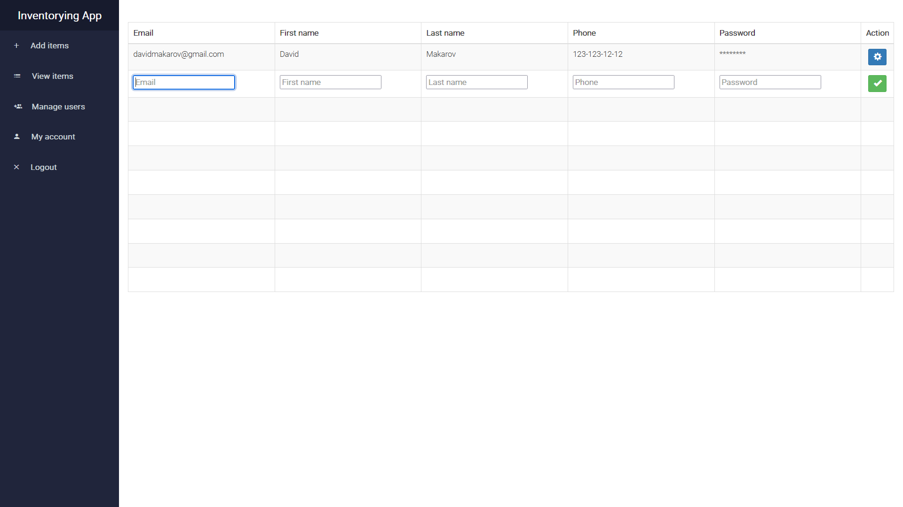
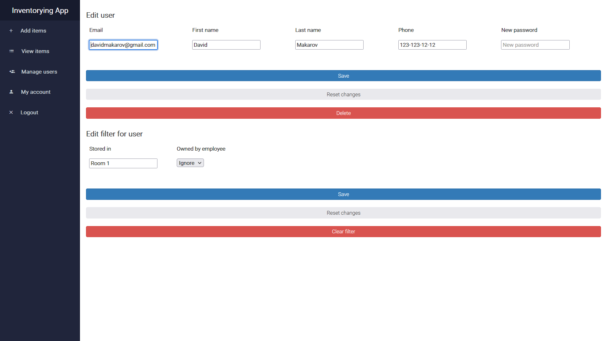
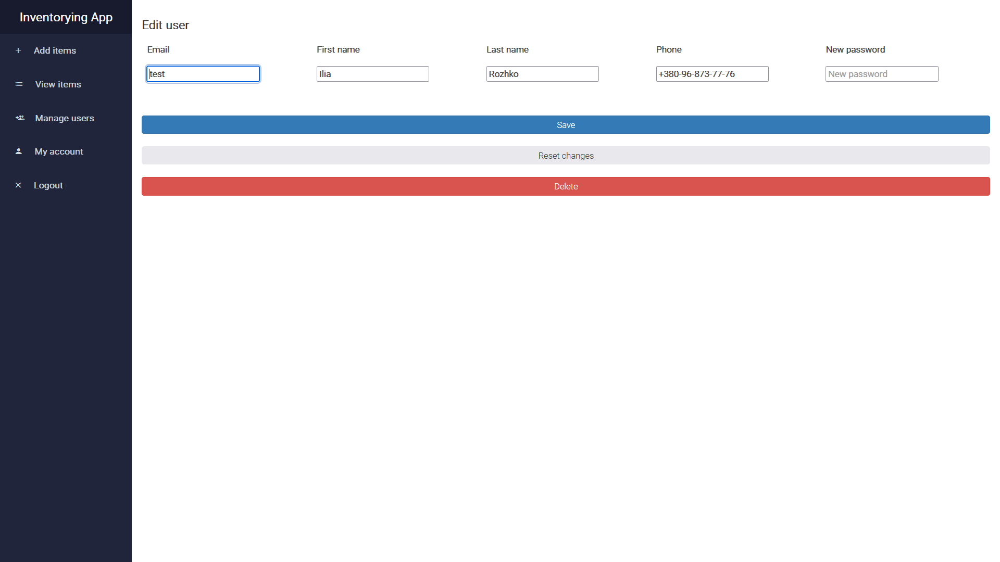

# Inventorying App

Spring-based web application for inventory, where you can add items, view, filter, and then carry out two types of
inventory: “sighted” and “blind” and then export the result to PDF. Also you can create accounts for your employees,
with limited functionality.

## Requirements

**Using Docker**

- [Java 21](https://www.oracle.com/java/technologies/downloads)
- [Docker](https://www.docker.com/)

**Without Docker**

- [Java 21](https://www.oracle.com/java/technologies/downloads)
- [Postgres](https://www.postgresql.org/download/)

## Installation

**Using Docker**

```bash
git clone https://github.com/IliaWithHat/inventorying-app.git
cd inventorying-app
docker-compose up -d
```

The site will be available on: http://localhost:8888/items

**Without Docker**

- Download sources.
- Create in Postgres database.
- Edit in [application.yml](src/main/resources/application.yml) datasource. Write the current url, username and
  password.
- In root directory run `./gradlew bootRun`.

The site will be available on: http://localhost:8080/items

## Tutorial for a user with the ADMIN role

### Register/Login page

First of all, you need to register or login. After registration, your role is ADMIN.\
Default login: test, password: 1234.




### New item entry page

Next, you can start adding items. This page will display the last five items in descending order.\
"Serial number" is a unique autoincrement number for each item (like SERIAL in Postgres).\
You can add items in different units: piece, ton, pair, liter, etc.\
Under each field, there is a checkbox "Save state of field" which saves the field after clicking
on the "Add" button.\
You can also enable autoincrement of the "Inventory number" field, which works in four cases:

- 12 -> 13, 999 -> 1000;
- 001 -> 002, 009 -> 010;
- 123-01 -> 123-02; 123-009 -> 123-010;
- 567.01 -> 567.02; 567.009 -> 567.010.

If you click on the button with the pen icon, you can go to the edit item page.



### Edit item page

Here you can change information about an item or delete it.



### View item page

Here you can view all items (only 20 items per page) and filter them.\
In "Item name", "Inventory number" and "Stored in" field you can write multiple words as condition like this:

- chair;table;closet
- 00000001;00000002

If you enter 12.12.2024 and 12.12.2024 in the "Time interval" field, items that are created between 00:00 12.12.2024 and
23:59 12.12.2024 will be displayed.\
If today is 12.12.2024 and select "1 day" in "Show items created in" field, items created since 00:00 on 12.12.2024 will
be displayed.\
You can export to Pdf by filter. [Result.](assets/files/table.pdf)\
And start "sighted" and "blind" inventory by filter.\
At the end of the pdf file it is written who, when and how carried out the inventory or export.



### "Sighted" inventory

"Sighted" inventory is inventory in which you see the item to be inventoried. Here you can only enter its quantity.
[Result.](assets/files/table(1).pdf)


### "Blind" inventory

"Blind" inventory is inventory in which you can't see the item to be inventoried. Here you can enter its inventory
number and quantity.\
If you started inventory in "Room 1" and entering items that are located in "Warehouse", they will be displayed in a
separate table in the pdf file. [Result.](assets/files/table(2).pdf)


### Manage users page

Here you can create maximum ten users with role USER.\
You can't see password, because it's encrypted, but it can be changed on the next page.\
If you click on the button with the gear icon, you can go to the edit user page.



### Edit user page

Here you can edit user info, change password and set a filter that determines what items the user will see.\
In "Stored in" field you also can write multiple words as condition by separating them with ";".



### My account view

Here you can edit your info.



## Tutorial for a user with the USER role

You can log in using the login and password that the ADMIN gave you, export to pdf
and inventory.


### If you find bugs or have any ideas, please leave a message at rozhkoilia5533@gmail.com.